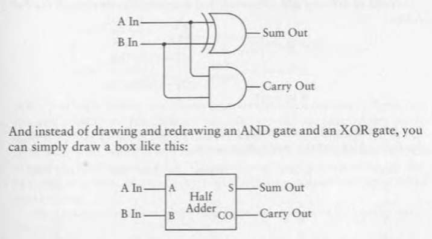
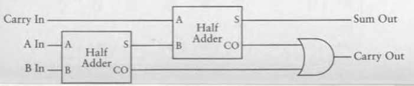
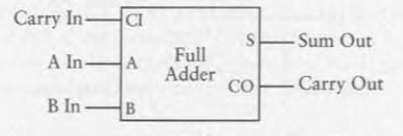
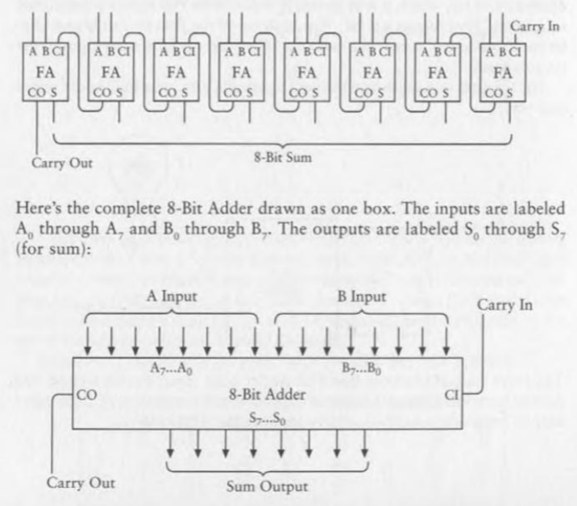
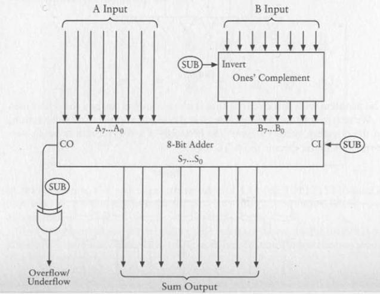
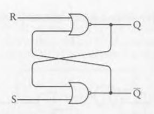
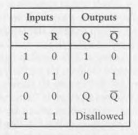

Have been reading "Code: The Hidden Language of Computer Hardware and Software" by Charles Petzold for a week now, the initial chapters were boring but the later ones got me hooked. Finally something that bridges the gap between simple electric components and actual low level computer hardware. 

When I got to the flip-flops section, I thought it would be a good idea to implement this. Maybe build like a microcontroller or some very basic cpu thing. I really love low level stuff so this is perfect for me. Uni is taking a lot of time so I read the book in-between classes or whenever we get free time, so I will be coding stuff on weekends.

I will be writing a "devlog" each commit explaining the changes, new additions, future thinking and whatever else I think.

- **(25 January, 2026)** *Added basic logic gates and a half adder.*
  
  I thought a lot about how to represent each unit in the circuit and eventually came to this conclusion. Very basic logic gates like {and, or, not} will be simple functions with lookup tables. Things that take in input, do some stuff with these gates and return some value(s) would be structures with their logic in a function, like a half adder. And stuff that take in complete bytes or chunks of data will be functions and these chunks itself would be structures, like a 8-bit adder. Complex ahh system but it works and let's hope it scales well. I also didn't wanna include the entire stdio.h library because it kinda kills the entire low level feel so I included only putchar from it and made a void function to print a bit on cli, also defined LOW = 0 and HIGH = 1 so it feels more like circuits. Gonna add a full adder next and maybe a 8-bit adder too.

  

- **(26 January, 2026)** *Full adder, 8-bit adder and major syntax change.*
  
  new syntax changes! Now the function names use camelCase and all the variables and structure names in lower case with underscores as delimiters. Also added a full adder (using two individual half adders) and a 8-bit adder, defined a byte structure too. Now there are a future problems for this system, the ordering of bits. Humans write the MSB (Most Significant Bit) in the left and the LSB (Least Significant Bit) in the right but looping through a array of bits (as defined in the code) is easier left to right, so effectively flipped from what we are used to. Gotta figure out something to combat this. This is like the little and big endian problem but for bytes. Another problem is that the code is getting too long too quickly, I should divide this into individual files or something soon.

   
  

- **(31 January, 2026)** *8-bit Subtraction and code reorganization*
  
  added carry out bit logic in 8-bit adder. Now you can pass in adress of the carry out bit and it will store the bit there. Similarly there is a 8-bit subtractor now that uses the inverted bit and addition by 1 logic. To combat the overflow and underflow condition, I have made a check to see if the out bit exists, if yes then print overflow/underflow and if not then print the number. Another major thing in this commit is the sepration of code into multiple files! Not all the logic headers and structures are in logic.h, all the initialization of those functions is in logic.c and the main usage of them is in main.c. We can compile this with `gcc main.c logic.c -o circuit`. tbh I just gave my code to ai and asked it what would be the best way to store it into parts and I think I like it. I also ended up addding the printf function becaust the putchar function was just not scaling well. I also found out that when you add the stdio.h library, apparently the linker only adds the functions that you use in your code. So adding the entire library isn't exactly bloat. Might add the entire library if I feel like it. Also regarding the "endian" issue in my last commit, I have made it so that in the print byte function the MSB is at the right and in the logic its at left. So best of both worlds, pretty sure if there were multiple people working on this they would scream at me because this will be leading to confusion, and maybe I am also gonna forget this at some point and waste time! So I added comments that I can read and understand the flow. Next up are the flip flops! They will be interesting because they are not functional, they depent on previous state and the input. Should be a good challenge to implement them. That chapter in the book is also very confusing, I am gonna have to re-read it a bit to unerstand it completely. 

  

- **(1 February, 2027)** *added rs flipflop!*
  
  finally got a working model of a rs flipflop. I made a struct, a initializer and a some loop logic to make it work and follow the truth table. I think for each flip flop we are gonna need a loop. I am concerned as to how will these parts interact with each other, because I am at the 'An Assemblage of Memory' chapter of the book and all the components are comming to togeather to make a ram and in the following chapter we are gonna we making a alu. Might have to tweak each parts implementation a little. Lets see what happens!

   