Have been reading "Code: The Hidden Language of Computer Hardware and Software" by Charles Petzold for a week now, the initial chapters were boring but the later ones got me hooked. Finally something that bridges the gap between simple electric components and actual low level computer hardware. 

When I got to the flip-flops section, I thought it would be a good idea to implement this. Maybe build like a microcontroller or some very basic cpu thing. I really love low level stuff so this is perfect for me. Uni is taking a lot of time so I read the book in-between classes or whenever we get free time, so I will be coding stuff on weekends.

I will be writing a "devlog" each commit explaining the changes, new additions, future thinking and whatever else I think.

- **(25 January, 2026)** *Added basic logic gates and a half adder.*
  
  I thought a lot about how to represent each unit in the circuit and eventually came to this conclusion. Very basic logic gates like {and, or, not} will be simple functions with lookup tables. Things that take in input, do some stuff with these gates and return some value(s) would be structures with their logic in a function, like a half adder. And stuff that take in complete bytes or chunks of data will be functions and these chunks itself would be structures, like a 8-bit adder. Complex ahh system but it works and let's hope it scales well. I also didn't wanna include the entire stdio.h library because it kinda kills the entire low level feel so I included only putchar from it and made a void function to print a bit on cli, also defined LOW = 0 and HIGH = 1 so it feels more like circuits. Gonna add a full adder next and maybe a 8-bit adder too.

  

- **(26 January, 2026)** *Full adder, 8-bit adder and major syntax change.*
  
  new syntax changes! Now the function names use camelCase and all the variables and structure names in lower case with underscores as delimiters. Also added a full adder (using two individual half adders) and a 8-bit adder, defined a byte structure too. Now there are a future problems for this system, the ordering of bits. Humans write the MSB (Most Significant Bit) in the left and the LSB (Least Significant Bit) in the right but looping through a array of bits (as defined in the code) is easier left to right, so effectively flipped from what we are used to. Gotta figure out something to combat this. This is like the little and big endian problem but for bytes. Another problem is that the code is getting too long too quickly, I should divide this into individual files or something soon.

   
  

- **(31 January, 2026)** *8-bit Subtraction and code reorganization*
  
  added carry out bit logic in 8-bit adder. Now you can pass in address of the carry out bit and it will store the bit there. Similarly there is a 8-bit subtractor now that uses the inverted bit and addition by 1 logic. To combat the overflow and underflow condition, I have made a check to see if the out bit exists, if yes then print overflow/underflow and if not then print the number. Another major thing in this commit is the separation of code into multiple files! Not all the logic headers and structures are in logic.h, all the initialization of those functions is in logic.c and the main usage of them is in main.c. We can compile this with `gcc main.c logic.c -o circuit`. tbh I just gave my code to ai and asked it what would be the best way to store it into parts and I think I like it. I also ended up adding the printf function because the putchar function was just not scaling well. I also found out that when you add the stdio.h library, apparently the linker only adds the functions that you use in your code. So adding the entire library isn't exactly bloat. Might add the entire library if I feel like it. Also regarding the "endian" issue in my last commit, I have made it so that in the print byte function the MSB is at the right and in the logic its at left. So best of both worlds, pretty sure if there were multiple people working on this they would scream at me because this will be leading to confusion, and maybe I am also gonna forget this at some point and waste time! So I added comments that I can read and understand the flow. Next up are the flip flops! They will be interesting because they are not functional, they depend on previous state and the input. Should be a good challenge to implement them. That chapter in the book is also very confusing, I am gonna have to re-read it a bit to understand it completely. 

  

- **(1 February, 2026)** *added rs flipflop!*
  
  finally got a working model of a rs flipflop. I made a struct, a initializer and a some loop logic to make it work and follow the truth table. I think for each flip flop we are gonna need a loop. I am concerned as to how will these parts interact with each other, because I am at the 'An Assemblage of Memory' chapter of the book and all the components are coming to together to make a ram and in the following chapter we are gonna we making a alu. Might have to tweak each parts implementation a little. Lets see what happens!

   

- **(7 February, 2026)** *added level triggered d flipflop and a adding machine*
  
  level triggered d flip flop was not much of a challenge, just a initializer function and a update function. But after making this stupid adding machine. I think I should make a documentation of this. The logic of the adding machine and adding all these parts together like the latch, the selector, the adder and chaining outputs, this all took me over 2 hours. And out oft hose 2 hours I was just debugging for 1.5 hours. Had to write the mechanism of a paper and consult a lot of LLM's (tbh LLM's didn't even help much, I was fixing their code more than they were fixing me). I can see how the parts connect but I don't think I can remember that in the long run, so I will be making a documentation of this. Development will be paused until documentation is complete until where the project is at right now. I also have exams in 2 weeks so I should not be focusing much here. Just writing stuff feels like the correct thing to do. Also, I am actually not sure if the adder works correctly or not, there may be some edge case that I haven't accounted for, I will fix it (surely).

  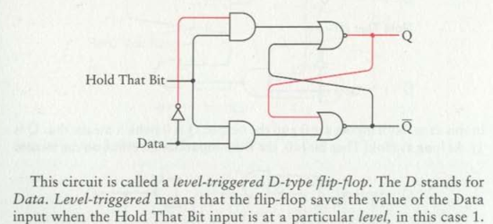
  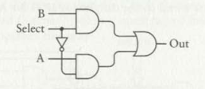
  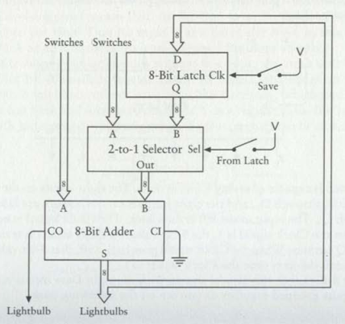

- **(14 February, 2026)** *project documentation and better full adder implementation*
  
  this week was really heavy lol. Lots of quizzes in uni, but it's over. Meanwhile I have added documentation to all functions! I have used doxygen styled documentation instead of having a big md file or some website that looks like it belongs in the 90's (they look fire though). doygen style works really well with vs code intellisense, when I hover over a function it shows the documentation in a popup menu, so I can just read the and understand the function! Oh btw I found out that writing the logic on paper with a pencil before implementing works really good, my brain says its good. Next up, I have split up the entire project into separate files because logic.c was growing really fast, the initializations are still in logic.h though. Along with this I also made a makefile because I ain't typing that compilation command (I didn't push this in the first commit mb). Another thing, I improved the adding machine! and by improved I mean that I scrapped the entire thing, wrote it on a paper, though for a little and wrote the same thing in 15 lines. Took me a good while though but I am proud of it! Now for future stuff, I will be implementing a edge triggered flip flop, ripple counter and a oscillator. No idea how I am gonna set a speed to the oscillator but I will figure it out. Let's see what happens next!

- **(15 February, 2026)** *edge triggered d type flip flop and a another one with preset and clear!*
  
  the circuits in the book are getting more and more complex. I won't lie, I gave the pictures and text to claude and tried to understand whatever code it gave me. I kind of understand the code but this like fragile. Like I don't think he best way to simulated a edge triggered is through a if statement, but I don't know any better way myself. The book is getting interesting too! Pretty sure I can make a working binary counter next week! I also figured out how to use doxygen documentation style better, like what to write and what not to write. I think I am gonna make individual builds for this, make a folder called builds where we can have individual c files of small components, to test the newly implemented stuff and to keep whatever I like. Right now theres just main.c which I used to wipe every time I wanted to test something new, this isn't good for history standpoint. Overall I am thinking that I should streamline (idk if this is the right word, but I don't know any better words to describe) the project more, divide the project into individual folders more. Another thing! Names of these functions and structures are growing lol, I think it's because the book has so much variety of the same thing. I'll look into it when it becomes a bigger issue (Hope I don't bite my words). Here are some pictures of d flip flops and the truth table!

  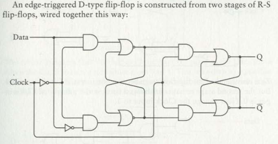
  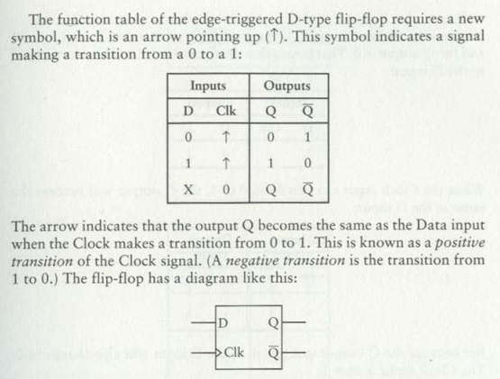
  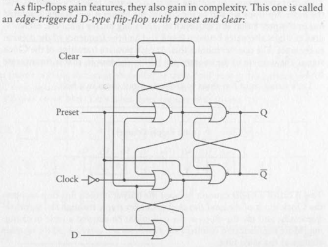
  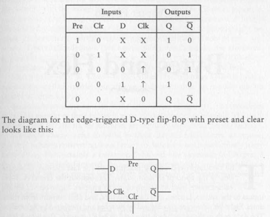

- **(15 March, 2026)** *unit tests are here, also exams finally over!*
  
  I didn't implement anything from the book today, I think I will add the binary counter next. But I did make a test folder where I have unit tests for each individual components. Now whenever I add a component, along with adding its logic to its respective .c file, I would write the test cases for it in the tests folder. I even made a separate makefile for tests to quickly test them! Also, there is a test specific header with macros to tell if something went wrong. Now, this stuff came up a month late because of uni exams, I did good but chem is still a pain. No worries, I am gonna drop it after this semester. I'll try to focus more on this moving forward, specially because I got some holidays coming up. Will defiantly speed this up now that I know how to properly use AI in workflow. Oh yeah, I tried OpenCode AI for coding. It's good but maybe its not for me, I just don't like things going soo fast. I am still relatively new to coding so typing by hand just feels correct to me. Needless to say, good technology, will def use in future. Right not, asking claude is enough. Also, I moved entirely to WSL! Before hand my setup was a complete mess. I had my code store in windows, used vscode to edit and a wsl instance to compile code. Later on I realized how slow everything was due to the transition layer. So I got a new Ubuntu instance, moved all my code to linux and installed that WSL extension. Its pretty good, I even got a Windows XP theme, looks pretty! I'll attach a screenshot. However, now I am gonna have to use cli git to commit to GitHub (I was using desktop version before this, ik that I can open wsl folder in desktop version but i just dont want to do that). New things to learn! Recently I got interested in microelectronics again! I bought a bunch of them in 2019 and when I went home, I found them again. Now that I am a bit grown up and know what they do, I am thinking of making something presentable. Another thing! I found a really cool game called 'Hidato', I love it!!! After playing it I realized that its just backtracking, I will be making a hidato solver with some gui just for fun. I love that game so much. So simple and fun and challenging. Alright, so I got holidays and a lot of work to do! This logic gates thing (binary counter next time), micro electronics thing, hidato solver, learning git cli and college work ofcourse!
  
  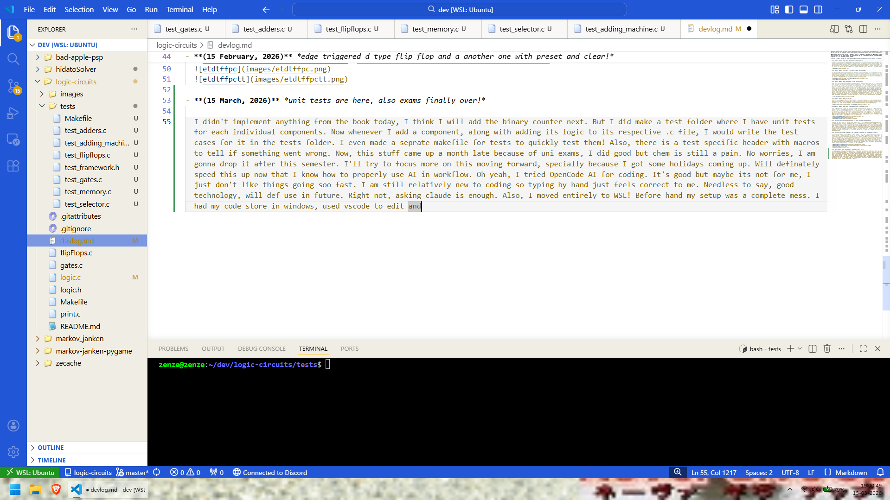

- **(16 March, 2026)** *hacks.c added and nothing else*
  
  only added hacks.c today, this file will contain hacks which will be used all around other files to make things more readable. It uses very basic logic to convert a hex number to a byte. Right not it only expects hex values of size 2, just two chars. Nothing more to add today, I have to focus more on other things.

- **(17 March, 2026)** *binary counter is here!*
  
  finally implemented a binary counter! ngl, I gave the code to claude and a image of what the counter looks like and it burned though my entire free plan usage while recursively prompting itself about code it has written and the errors it has. After running out of free messages, I sat down and wrote it myself. Took me 40ish minutes to figure out the code of the tickEightBitCounter function but I wrote it none the less. Claude could have written the same code in like 4 seconds (if it understood it better, L bozo), but hey, I can explain how my implementation of an eight bit counter works to a 4 year old. Other function were easier. Then I wrote a small script to demonstrate the counter. After this my free tier usage resumed so I got claude to write tests for the counter functions and style the output of counter.c Aside from that I used the hexToByte function in the test files, it feels more professional now for some reason lol. The image for the binary counter is really pretty in the book, I'll add it here. Nex up is a RAM! But I will take some time to make it, I am thinking of making a blog website. I don't enjoy social media much so I am gonna make some very basic blog website of my own. When I say very basic, I mean it. It might look like something from 90's. So next weekend (which starts tomorrow) I will be making a simple website for myself, and whenever I get money I will host it as well! The purpose of the blog is not to capture an audience but to archive my thoughts and timelines of my projects for my future self! 

  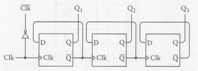
  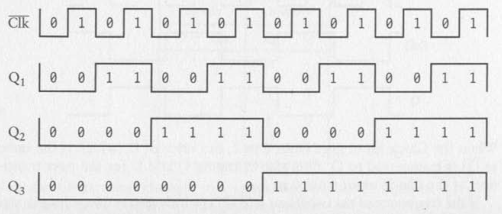

- **(28 March, 2026)** *the ram is finally implemented!*
  
  After a stressful week of uni and making that website, I finally got the time to implement a RAM. As expected, it's some long code. Longest I've written so far I think. Not sure. I've made 3 variants. 8x1 normal one, 8x8 one with an API to use it, its built bu using 8 8x1 rams, and the last one, a 64K ram chip. Now I was not gonna make a 65536 or so selector and decoder, so I use a hybrid design of using flip-flops for storage and index directly for address decode. Is this faster? most definitely. Is this cheap memory wise? Maybe if I optimize it, it will be. I use malloc but the issue is that the 64k ram has is just a array of 65536 d type flip flops, and they are just a rs flip flop, and they are just a struct with 2 bits, q and ~q. So roughly it takes about 4MB space for a single RAM chip. This is not much but its heap memory + it will scale with time. I'll circle back to this in hopes of optimizing or migrating to a better system. I've pretty much finished the book, the later chapter are a bit more history and hardware oriented. I presume that I will make a full fledged microcontroller by the end of this, if I don't lose the motivation. If I want, I may work on this a bit more after that, maybe turn this into a my own tiny 8-bit os? But for now, the finishing line is to make a microcontroller. Up next in the book are op codes, essentially assembly language. It would be so fun, making a ALU and my own little language. I bough a new book btw, CS:APP. I read it's pdf a bit and it interested me, I had some money so I bought it! Lets see how it goes.
  
  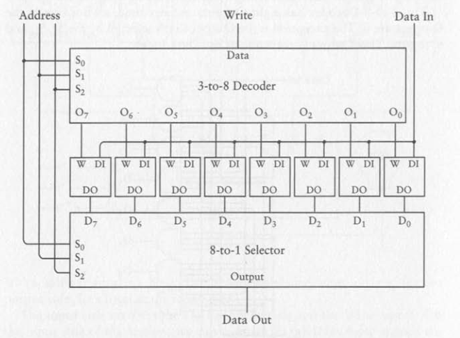
  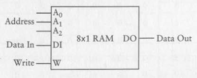
  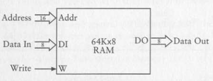

- **(29 March, 2026)** *added alu and an Instruction Register*
  
  These two components were't that hard but fundamental. Alu specially was interesting to code, it reminds me of a game named TIS-100. Its essentially a puzzle game to teach you assembly, it has these boxes which are essentially accumulators and can move data from all 4 ends. Fun game. Next up is the control unit and the CPU. The project is pretty much done, feels good! I also deleted the tests for counters and ram because they already have demo's. Doesn't make sense having both tests and demo's. Also, I think demos are for bigger components and tests are got smaller components. Oh, I also got a spell checker extension because my typing is really weird, so now I will be fixing and hopefully making less typos.

- **(30 March, 2026)** *added control unit*
  
  Most complex component yet, and the most satisfying as well. And I missed my first class this morning because I was up at night working on this. Its has the main purpose of loading the program, using the instruction register and executing the program. Really feels like I've made something now lol. Next up is the cpu! 

- **(2 April, 2026)** *added cpu api, updated libraries and reduced memory usage by 1/4*
  
  CPU was not hard, its just a wrapper around the current individual components. I added a demo with 3 test programs which all work! Very proud of this little project! I also started using stdint to reduce the size of int that we are using, now all malloc uses should allocate 1/4th of what they were doing beforehand. This was happening because by default, enum allocates normal integers, and I was using it for bits, so I was allocating a lot of redundant space. Fixed this by using unit_8, a simple 8 bit integer. Its the minimum I can do without going into much hassel. THe 64 kb ram was allocating almost 4MB before this, now it allocates only 1MB. Quite an improvement. next up I want to refactor and organize the project into some properly labelled folders. Lets see when I get the time for that.

- **(4 April, 2026)** *reorganized the entire project and made a readme*
  
  Now, the entire project is organized into folders. All the .c files live in src/ and the logic.h file lives in include/. It looks much cleaner now. I also asked claude to generate a readme for this, surprisingly the readme it made had a lot of errors, so I had to write a lot more than I wanted. Now, with this the project comes to a halt. I have accomplished everything I wanted and I don't have much free time now. If I end up working on this again, it would probably be after July. At most I can implement a small 8-bit OS, but even that is too much to do. Oh btw, I bought a new book CS:APP, I read the preface and it promises very big things! Lets see how it goes.